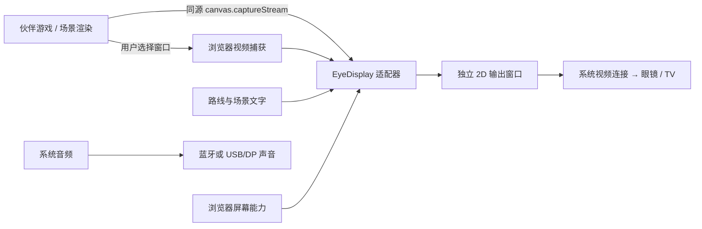

# EYE OS · Emma0923 · 自动屏幕适配 v0.3

当前实现是一层通用 2D 显示适配器：眼镜被手机或电脑识别为视频显示设备后，按实际窗口尺寸显示内容。它不假设品牌、分辨率或蓝牙名称代表已兼容，不承诺任意眼镜通过蓝牙接收游戏视频。

## 连接和使用

1. 音频眼镜在系统蓝牙中配对。当前 E06-003B 没有屏幕，只用声音功能。带屏眼镜还需要其支持的视频连接；USB-C 必须支持视频输出，只有接口形状相同并不足够。部分设备音频走 USB/DP，也不必强制走蓝牙。
2. 打开概览中的“换副眼镜，继续出发”，点击“授权自动识别”。支持 Window Management API 的桌面浏览器在用户授权后列出逻辑屏幕；首次授权由浏览器确认。
3. 只有一个明确的外接屏时自动选择；多个屏幕时选一次。选择仅保留在当前页面会话，不存储屏幕身份。镜像模式可能只返回一个逻辑屏幕，可以使用本机预览。
4. 点击“打开眼镜 / 外接屏画面”。浏览器允许时将新窗口放到所选屏幕；若限制定位，可手动移动。进入全屏仍需在输出窗口点击“全屏”。网页不修改 Windows 的镜像/扩展设置。
5. 已有游戏可点击“共享游戏画面”，在浏览器选择器中选实际游戏窗口或标签页。不要选择控制台或输出窗口，以免递归。系统音频保持自己的输出路径。每次新的共享都需由用户选择，网页不能静默抓取桌面。
6. 断开目标、撤销显示授权、关闭输出或离开控制台，都会结束已有共享。选择器在打开期间被停止时，之后返回的媒体流也会立即释放，不会自动恢复。

## 自动化范围

| 能力 | 当前行为 |
| --- | --- |
| 显示器发现 | Windows 只读诊断 + 浏览器经授权的实际屏幕列表；不把一块普通显示器标为眼镜 |
| 目标选择 | 依据 `isInternal === false`；主屏不等于内置屏，名称相同不等于同一设备 |
| 尺寸与方向 | 随输出窗口变化更新；视频等比例完整显示，默认留 4% 边距，可调 0–12% |
| 混合 DPI、负坐标 | 定位直接使用浏览器 CSS 坐标；不把 Windows 物理像素乘除后猜测位置 |
| 插拔 | 已授权时监听 `screenschange` 和各屏幕 `change`；新屏可自动识别，重新打开仍需点击 |
| 无权限 / 不支持 API | 显示明确提示，保留本机预览与系统镜像操作；不宣称设备不存在 |
| 内容 | 本地风景示意、与声音导览同步的路线标题，以及用户选择的游戏窗口视频 |
| 双目与光学 | 固定安全默认 2D；不把宽画面判定为 SBS，不读取或猜测瞳距、近视度数 |
| 无线与手机 | 只有系统/厂商能接收视频的镜像路径才能使用；本版没有开发通用 Wi-Fi 接收器或手机原生投屏 SDK |

这里的风景为图形示意，不是实景、Google Maps、完整 3D 游戏或云端多人功能。浏览器共享会引入平台相关延迟；低延迟正式游戏建议直接让游戏渲染至眼镜屏幕，并做真机测量。

## 合并接口



脚本边界：`display-core.js` 是无 DOM 的选择与布局策略；`display-controller.js` 绑定本控制台的 DOM；`display-receiver.js` 只负责输出页。复制 controller 到别的页面前需提供对应元素或抽离界面绑定。

在用户已打开输出窗口的**同源控制台页面**中，可以使用以下实际接口：

```js
window.EyeDisplay.getState();
// { windowReady, sharing, displayPermission, mode: 'mono' }

window.EyeDisplay.setScene({
  title: '海边慢行', subtitle: '跟随自己的节奏',
  region: 'AMALFI, ITALY', theme: 'amalfi'
});

// 伙伴将游戏 canvas 接入同源页面后可直接传本地视频流。
// 必须先由用户打开输出窗口；本调用不替用户创建窗口或索取权限。
const stream = gameCanvas.captureStream(30);
try { await window.EyeDisplay.presentStream(stream); }
catch (error) { stream.getTracks().forEach(t => t.stop()); throw error; }
window.EyeDisplay.stop();
```

`presentStream` 接管有效流的生命周期，替换或停止时释放所有轨道。调用方不要把同一条流同时用于必须继续运行的其他用途。捕获失败或窗口不可用时，调用方应释放自己创建的流。当前没有 WebRTC、跨设备流媒体、上传或录制接口。游戏在另一台设备或另一来源运行时，需另外设计协议，不能直接调用该同源对象。

也可向本页分发 `eye:scene` CustomEvent，detail 与 setScene 参数相同。所有文字以 textContent 呈现，未知 theme 和 mode 归一化。输出页通信使用固定 `eye-display-v1` 协议，同时验证来源和当前窗口引用。

运动方向、阻力、电机和急停仍由伙伴控制；本接口不发送任何外骨骼控制指令。**2026-09-24 已核对 aima 的 ShellOS / Three.js 主分支基线 `c4f465b8e3d7afd400ebfaafccfebb251c9f63b2`；v0.3 已新增独立的只读 `/state` 桥接及三层状态界面**，详见 [外骨骼指南](EXOSKELETON-Emma0923.md)。游戏事件、声音联动和真实游戏画面到显示眼镜的完整链路仍待接入或验收；只读遥测本身不会把游戏画面传入眼镜。

## 本机诊断 API

`GET /api/displays` 仅本机可用，与音频 API 分开缓存 3 秒。返回：

```json
{
  "available": true,
  "platform": "windows",
  "checkedAt": "2026-09-23T07:44:02.314Z",
  "displays": [{"id":"display-1","label":"显示器 1","primary":true,"x":0,"y":0,"width":2560,"height":1600}]
}
```

上述是本次实机快照，不是设备的固定配置。坐标为物理桌面像素，只用于诊断；ID 为当次枚举序号，不是可持久化的眼镜身份。检测失败返回 `available:false`、空数组和 `STATE_UNAVAILABLE`；非 Windows 为 `UNSUPPORTED_PLATFORM`。不得将失败当作“无外接屏”。不输出序列号或硬件识别串，不修改系统显示设置。

## 验收边界与官方参考

软件选择策略与生命周期可自动测试，真实眼镜的视频输入、遮挡、安全边距、延迟、全屏和断线行为仍需逐型号验收。当前没有带屏眼镜的实机认证记录。手机布局验证也不能替代 iOS / Android 投屏验证。

- [Chrome Window Management API](https://developer.chrome.com/docs/capabilities/web-apis/window-management)：权限、屏幕属性与变化事件。
- [Chrome 屏幕共享控制](https://developer.chrome.com/docs/web-platform/screen-sharing-controls)：用户选择的捕获来源与浏览器约束。
- [XREAL One 官方连接说明](https://us.shop.xreal.com/blogs/buying-guide/user-guide_xreal-one-series)：USB-C DP 视频及适配连接。
- [VITURE 适配器官方说明](https://www.viture.com/academy/adapters/usb-c-xr-charging-adapter-ultra)：区分视频连接、充电与厂商数据能力。
