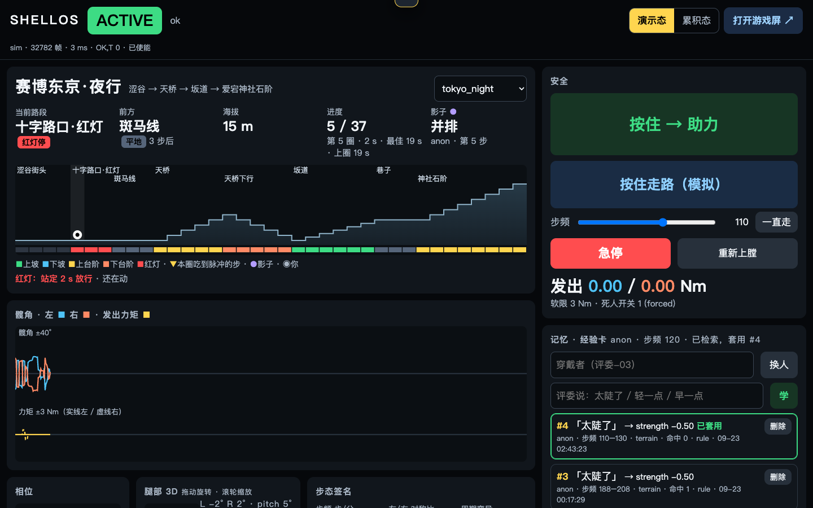
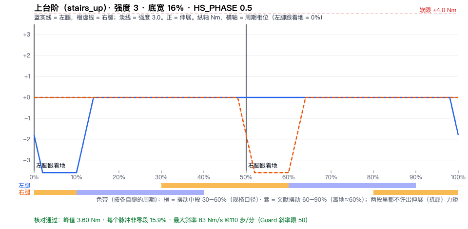

# 峰哥亡命天涯 · ShellOS

现在的 VR、体感、跑步机游戏都只有视觉反馈——画面加手柄震动，腿是空的，几乎没有人做物理反馈；**我们做的就是登山走路的物理反馈**：穿上一台量产的消费级髋外骨骼原地迈步，屏幕里的你在爬珠峰北坡，坡和台阶变成腿上真实的阻力和助力（上台阶阻力、下台阶助力 + 落阶冲击；软限 4 Nm，安全员是硬代码）。游戏是载体，主角是外骨骼控制软件 **ShellOS**——官方 App 禁了这个型号，控制层从串口起全是我们自己写的；你说一句「太陡了」，AI 蜂群当场改手感、存成经验卡传给下一个人，再说一句话，大模型现场造一座山。

> 峰哥口吻版：「VR 只骗眼睛，这玩意儿骗腿，这是个好事儿啊。」


<sub>9/24 凌晨离线预览（`--sim` 模拟外骨骼，W 线风雪第 3 轮）。**演示视频**：`[ 60 秒视频，V2 线 9/24 出，素材在 docs/提交/视频素材/ ]` · 分镜见 [60 秒演示脚本](docs/提交/60秒演示脚本.md)</sub>

**三步跑起来**（不用外骨骼；Python 3.9+，依赖只有 `pyserial / pygame / pynput / pytest`，前端离线可用）

```bash
git clone https://github.com/QiuQiuNB666/aima && cd aima
python3 -m venv .venv && .venv/bin/pip install -r requirements.txt          # 1. 装
.venv/bin/python -m shellos.main --sim --ctl terrain --force-deadman       # 2. 起模拟外骨骼
# 3. 浏览器开 http://localhost:8765/game（按住空格走）· /worlds 选山 / 一句话造山 · / 仪表盘（「评委说」、经验卡、蜂群时间线）
```

有外骨骼：`./run-mac.sh --ctl terrain --stepping --cap 4 --strength 3.0 --width 16 --http 8765`（按住手柄 R2 才有力，× 急停）；展位一键启动见 [展位启动清单](docs/提交/展位启动清单.md)。

**团队**：球球（控制栈 / 步态 / 游戏 / 蜂群 / 真机 / 主讲）· anni（开场主持、带穿戴、感知实验）· 艾玛（声音）· Penn（珠峰地图、真人测试）

**授权**：峰哥本人 9/23 当面口头同意本次展示使用其肖像、口吻和 AI 复刻声音；素材来自 MIT / Apache-2.0 开源仓库；助理「小 B」是 VRoid 官方样例 AvatarSample_B（VRoid 官方样例，VRoid 样例条款：可免费再分发、免署名） + three-vrm（MIT）；东京攻壳致敬版全部程序生成、不复刻原作——逐项见 [素材授权](docs/提交/素材授权.md)。

---

> **队友看这里**：今天的进度、怎么跑、谁在改什么 → [`docs/队友跟进.md`](docs/队友跟进.md) · 分工表 → [`docs/指挥板.md`](docs/指挥板.md)

- **蜂群**：教练（大模型）· 地形导演（大模型）· 记忆员（代码）· 安全员（**硬代码，故意不交给大模型**）；仪表盘时间线上看得见每一步的提议 / 同意 / 裁剪 / 否决。名字的巧合：峰哥当年合伙的公司就叫「蜂群文化」
- **经验卡闭环**：一句话改参数 → 存成卡 → 下一个步频相近的人自动继承 → 删卡立即回退
- **珠峰北坡 · 主打**（67 步，惊险优先）：大本营 → 东绒布冰川 → 北坳冰壁 → **北坳裂缝·横梯**（走太快会失足）→ 北坳吸氧 → 北山脊 → **大风口·刀脊** → 第一台阶 → **北壁横切·贴壁栈道** → 第二台阶排队 → 中国梯 → 8848.86。直升机只作峰哥「亡命小飞机」梗、只在大本营落一次（北坡禁飞，[考据 §8](docs/珠峰-考据.md)）。专项设计 [珠峰-架构](docs/珠峰-架构.md)
- **9/24 凌晨**：峰哥新低多边形身体 + 每张地图一套穿搭；助理「小 B」替代追兵捷风；跑酷追兵改四脚机甲、免手换道（抬膝保持 0.3 s）、跳 / 滑按路程参数化；东京攻壳致敬版 5 个彩蛋；操作台与选山页重设计；导游稳定性（声道仲裁、自动播放解锁、状态机）
- **9/23**：台阶手感按球球穿真机的反馈反过来（上台阶 = 支撑期阻力，摆动期不压腿；下台阶 = 落阶冲击 + 助力）；屋顶跑酷 `/parkour`（步频 = 跑速）；大屏「腿上的力」波形 + AI 决策卡
- **大模型与兜底**：大脑进程用官方 anthropic SDK，凭据顺序 Claude > MiniMax-M3；截至 9/23 下午没有 Claude key，跑的是 MiniMax-M3（教练 23/23、造山 p50 7.0 s）。断网时教练走规则表、造山走关键词模板、峰哥走内置语录，经验卡上显示模型名、兜底显示 `rule` / `canned`
- **峰哥素材**：照片来自 [talk-to-fengge-live](https://github.com/w466747380/talk-to-fengge-live)（MIT），口吻节选自 [feng-ge-skill](https://github.com/YixiaJack/feng-ge-skill)（MIT）；音色的参考音频来自 [talk-to-fengge](https://github.com/YeJe-cpu/talk-to-fengge)（Apache-2.0），合成音频只存本机、不公开发布

EvoTavern 进化酒馆黑客松 · 深圳站（2026-09-21~24）· 01 具身与穿戴硬件赛道（SHELL FORGE）
设备：Hypershell X MaxS 髋关节外骨骼 · 黑客松专用固件 2.9.99.1 · USB 串口 3 Mbps · 力矩 ±7.5 Nm 硬限
游戏原名「山的记忆」，现名「峰哥亡命天涯」；控制软件叫 ShellOS。提交材料：[`docs/提交/`](docs/提交/项目介绍.md)

> 口径：数字后面标来源——**真机**（9/22 现场）、**回放**（用 9/22 真机录制离线跑）、**模拟**（模拟外骨骼）、**文献**、**待真机验证**（9/24 上午确认）。

| 登山游戏（评委看） | 操作员仪表盘（队友看） |
|---|---|
|  |  |
|  |  |

<sub>截图均为 `--sim` 模拟外骨骼（9/23 夜 – 9/24 凌晨）。</sub>

---

## 快速开始

需要 Python 3.9+，依赖只有 `pyserial / pygame / pynput / pytest`；前端 Three.js 和人物模型放在 `shellos/ui/static/vendor/`、`models/`，**离线可用**。

```bash
python3 -m venv .venv && .venv/bin/pip install -r requirements.txt
.venv/bin/pytest -q                      # 安全层、步态、地形、故障注入
```

### 1. 模拟（没有外骨骼）

```bash
.venv/bin/python -m shellos.main --sim --ctl terrain --force-deadman
```

- `http://localhost:8765/worlds` 选一座山 → `/game` 登山游戏；按住**空格**走、`1/2/3` 慢/中/快、`R` 回山脚
- `http://localhost:8765/` 仪表盘：「按住走路（模拟）」、步频滑条、「评委说」输入框、经验卡、急停
- 命令行驱动：`curl -X POST localhost:8765/sim -d '{"walk":true,"cadence":110}'`
- 无头环境加 `SDL_VIDEODRIVER=dummy` 和 `--no-input`；换端口 `--http 8801`；不写录制 `--no-record`
- 离线预览某个画面：`/game?preview=taishan_18pan&pos=20&ghost=18`（`&summit=1` 看山顶）

### 2. 回放（用 9/22 真机录制）

```bash
.venv/bin/python -m shellos.main --replay data/recordings/0922-174946-qiuqiu.csv --ctl terrain --force-deadman
.venv/bin/python scripts/gait_audit.py                 # 12 段录制 × 1080 档步态门限扫描
```

`--force-deadman` 只允许配合 `--sim` / `--replay`，真机启动会直接报错。
`0922-181327-qiuqiu.csv` 里有 3 行两帧粘连（录制器当时没加锁，9/23 已修），`--replay` 会跳过坏行并计入 `bad`。

### 3. 真机

```bash
# 外骨骼先开机进入工作态，再插 Type-C
.venv/bin/python scripts/probe.py                      # PING → VERSION → ENABLE → 看 3 秒数据 → DISABLE
.venv/bin/python scripts/probe.py --torque 0.5         # 发 0.5 Nm（默认 3 秒），确认正值是伸展还是屈曲
./run-mac.sh --ctl transparent                         # 先透明模式，只读数据
./run-mac.sh --ctl terrain --cap 2.5                   # 登山，软限 2.5 Nm；日志 /tmp/shellos.log
./run-mac.sh --ctl terrain --cap 2.5 --stepping        # 展位没走廊、原地踏步摆幅小（±6° 左右）时用踏步模式
.venv/bin/python scripts/afc.py --trials 10            # 蒙眼二选一：分上坡 / 下坡
```

- **手柄**（USB）：**按住 R2 才有力**（按多深力多大）· × 急停 · ○ 重新上膛 · ↑↓ / ←→ 调参数 · L1/R1 切控制律 · △ 打标记 · Options 演示复位
- **键盘**（全局热键默认关，加 `--hotkeys` 才开）：空格 = 死人开关 · Esc = 急停；重新上膛只走手柄 ○ 或仪表盘按钮（游戏页的 R 是回山脚，不会解除急停）
- 服务监听 `0.0.0.0`：局域网里的另一台设备只能**看**游戏屏 `http://<MacBook IP>:8765/game`；所有 POST（死人开关、急停、换人、/sim）只接受 MacBook 本机，其它来源一律 403
- 真机已确认：串口 `/dev/cu.usbserial-*`（CP2102N）、183 Hz、R2 = axis 5、× = button 0（真机）。**待真机验证**：正力矩 = 髋伸展、髋角负 = 屈曲（数据推断；右腿读数镜像，`convention.py` 已取反）、脚跟着地在估计器相位 0.5

Claude（可选）：本机跑大脑 `brain/claude_brain.py`（要 `ANTHROPIC_API_KEY`），展位 MacBook 用 `ssh -N -R 8790:127.0.0.1:8790 zhongrenfei@100.112.252.66` 借过去；大脑不在就走规则表。详见 `docs/架构-v3-完整版.md`「大脑与蜂群」。

---

## 架构

```
┌────────────────────────────────────────────────────────────────────┐
│ 5 记忆 · Agent   一句话 → 参数差值（大模型优先，规则表兜底，幅度裁剪）     │ shellos/memory/ agent/
│                  → 经验卡 → 按「控制律 + 步频区间」检索 → 删卡回退         │
├────────────────────────────────────────────────────────────────────┤
│ 4 界面           登山游戏 /game · 世界选择 /worlds · 仪表盘 /              │ shellos/ui/
│                  标准库 HTTP，/state 10 Hz；手柄 · 键盘                    │ shellos/input/
├────────────────────────────────────────────────────────────────────┤
│ 3 控制律         terrain（主）· puppet（共驾）· dofc · phase · constant · transparent │ shellos/control/
│                  只输出「期望力矩」，从不碰串口                             │
├────────────────────────────────────────────────────────────────────┤
│ 2 步态估计       极角相位 · 周期接受 · 步频 · 置信度 · 走动中                │ shellos/gait/
├────────────────────────────────────────────────────────────────────┤
│ 1 安全层 ★       Guard：唯一写串口的地方                                    │ shellos/safety/guard.py
├────────────────────────────────────────────────────────────────────┤
│ 0 设备           真机串口 · 模拟 · 回放 · 录制（同一接口，上层无感）          │ shellos/device/
└────────────────────────────────────────────────────────────────────┘
        ▲ 183 Hz 数据帧（髋角 / 角速度 / 腰部 IMU / 气压）   ▼ T,左,右（100 Hz）
                 Hypershell X MaxS · 黑客松固件 2.9.99.1
```

- **线程**：设备 183 Hz（真机）→ 控制 100 Hz（步态 → 控制律 → Guard）；手柄 100 Hz；HTTP；大模型按需、秒级，**永远不在 100 Hz 循环里**。控制循环最大间隔 12 ms、一拍 <1 ms（真机）
- **世界**：`shellos/worlds/*.json`，地形控制律和游戏读同一份。8 个：**珠峰·北坡（67 步，缺省）** · 赛博东京·夜行（37 步，含红灯）· 泰山·十八盘（39）· 富士山·吉田线夜登（40）· 华山·长空栈道（60）· 深圳梧桐山·好汉坡（35）· 训练场·台阶 / 长坡。加一座山 = 加一份 JSON。东京是街景拼贴；山路按真实路段比例压缩，海拔为约数
- **地形脉冲**（相位以脚跟着地 = 0%，梯形，缺省强度 1.5）：上坡 +1.5 Nm @11% · 下坡 −1.2 @10% · 上台阶 −1.8 @6%（支撑期阻力，摆动期不压腿）· 下台阶 落阶冲击 −1.5 @0% + 助力 +1.5 + 摆动期 −1.2 @68% · 红灯走着 −0.75、两腿站稳 1.5 s 放行（6 s 兜底）。上坡依据文献（Lay 2006；Montgomery 2018；McGrath & Sergi, ICORR 2019），下坡制动方向是推断；台阶手感 9/23 按球球真机反馈反过来（上楼 = 阻力）。展位启动参数 `--cap 4 --strength 3.0 --width 16`，峰值翻倍
- **闭环学习**：「太陡了」→ `strength −0.5` → 经验卡（触发 = 当前步频 ±10）→ 立即生效；删卡立即反向回退；换人走满 6 步自动检索；每圈登顶这一圈成为下一位的影子

全文：[docs/架构-v3-完整版.md](docs/架构-v3-完整版.md)

## 安全

| 规则 | 值 |
|---|---|
| 唯一出口 | 只有 `shellos/safety/guard.py` 写串口 |
| 软限 | 展位 4 Nm（启动参数 `--cap 4`，不带参数 3 Nm；≈0.05 Nm/kg，低于文献扰动实验最低档 0.08 Nm/kg）；固件 ±7.5 Nm 永远不用满；地形控制律自己也裁在软限以内 |
| 斜率 | 50 Nm/s（文献 ≤150） |
| 死人开关 | 手柄 R2 / 本机网页按钮（/ 键盘空格，需 `--hotkeys`），多来源取最大、按压深度缩放；松开 → `T,0,0`（不断数据流） |
| 置信度门控 | 步态置信度 <0.5 → 0 |
| 看门狗 | 控制循环 100 ms 没提交 → 0；1 s → DISABLE（固件自己 100 ms 不续发也清零） |
| 断流 | 数据 200 ms 没更新 → 0 |
| 急停 / 退出 / 异常 | 必 DISABLE；急停后要手动重新上膛 |
| 共驾 puppet | 满杆 2 Nm、缓升 ≥300 ms；单段 ≤10 s、被控者只能是队友（操作规程） |

安全层语义任何一条线都不能放宽。单测：`tests/test_guard.py`。

## 数据与验证

| 项 | 结果 | 来源 |
|---|---|---|
| 握手、数据流、力矩下发 | PING → VERSION → ENABLE；183 Hz；`OK,T` 323 条 | 真机 9/22 |
| 录制 | `data/recordings/` 12 段（7 段可用，穿戴的都是球球本人；4 段髋角全 0） | 真机 9/22 |
| 步态假周期（穿戴坐 / 站） | 13 → **0** | 回放 |
| 走动段步子接住率 | 0.25 → **0.44**；步频中位 108（P10–P90 77–125） | 回放 |
| 脉冲形状核对 | 5 路段全过；27 组参数边界扫描 0 组不过 | 模拟 |
| 游戏帧率 / 对控制的影响 | 1080p 50–58 fps；loop_ms 中位 14 → 15 ms | 模拟（开发机 i5-7400 核显，MacBook 未测） |
| 脉冲手感、力矩方向、HS_PHASE、2AFC | — | **待真机验证** |

报告：[步态审计](docs/报告/步态审计.md) · [地形手感](docs/报告/地形手感.md)（图在 `docs/报告/脉冲/`）

录制格式：CSV，`kind,t_host,ms,pitch,roll,yaw,gx,gy,gz,ax,ay,az,kpa,l_deg,r_deg,l_dps,r_dps,tl,tr`；标签在同名 `.marks.csv`。

## 目录

```
shellos/
  main.py              装配：设备 → Guard → 控制律 → 100 Hz 循环 → 手柄 / 键盘 / 网页
  device/              serial_link（真机）· sim（模拟）· replay（回放）· recorder · frame · convention
  safety/guard.py      安全层，唯一写串口
  gait/estimator.py    步态估计
  control/             terrain · puppet · dofc · phase_profile · constant · base(transparent)
  memory/store.py      经验卡（data/experiences.jsonl）
  agent/interpret.py   一句话 → 参数差值（大模型 / 规则表）
  worlds/*.json        世界：路段 + 主题
  ui/server.py         HTTP：/state 与动作接口
  ui/static/           index.html（仪表盘）· game.html + game/（登山游戏）· worlds.html · vendor/ · models/
  input/               gamepad · hotkeys
scripts/               probe · afc（2AFC）· gait_audit · pulse_plot · strength_ladder · collect · shot.sh
tests/                 test_guard · test_gait · test_terrain
data/recordings/       9/22 真机录制
docs/                  架构、报告、调研、提交物（docs/提交/）
run-mac.sh             MacBook 上（重）启动
```

## 提交物

[项目介绍](docs/提交/项目介绍.md) · [海报文案](docs/提交/海报文案.md) · [60 秒演示脚本](docs/提交/60秒演示脚本.md) · [4 分钟展位脚本](docs/提交/4分钟展位脚本.md) · [评委题库](docs/提交/评委题库.md) · [素材授权](docs/提交/素材授权.md) · [展位启动清单](docs/提交/展位启动清单.md)

## 我们不说的话

不说「首个腿部力反馈 / 首个 VR 外骨骼」（Holotron 2020 就用主动力矩做过楼梯和斜面，但挂在固定平台上）；2AFC 做完之前不说「能分辨坡度」；不说「Hypershell 官方开放接口」（我们用的是黑客松专用固件 + 现场发的串口协议）；不做医疗器械定位；不说「北坡直升机救援」（禁飞，那架只是峰哥的梗）；东京只说「致敬版」。

团队：球球 · anni · 艾玛 · Penn
