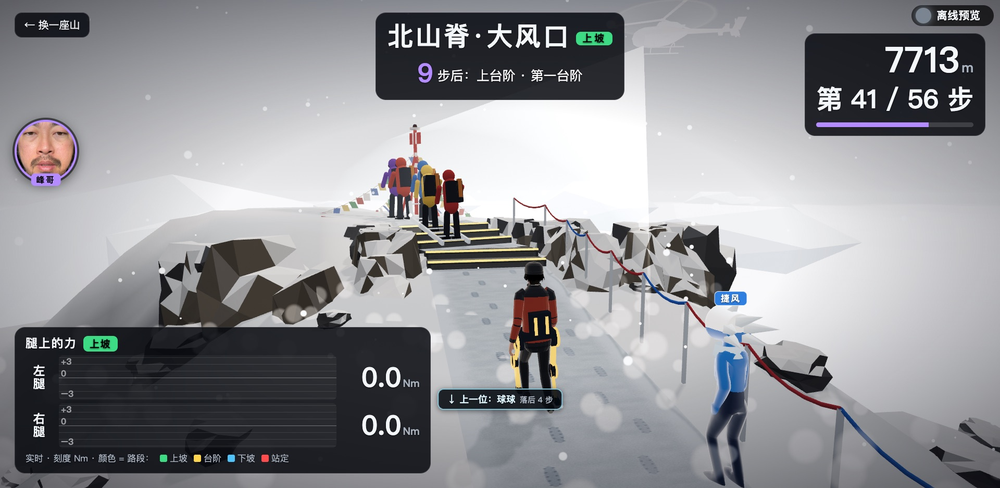
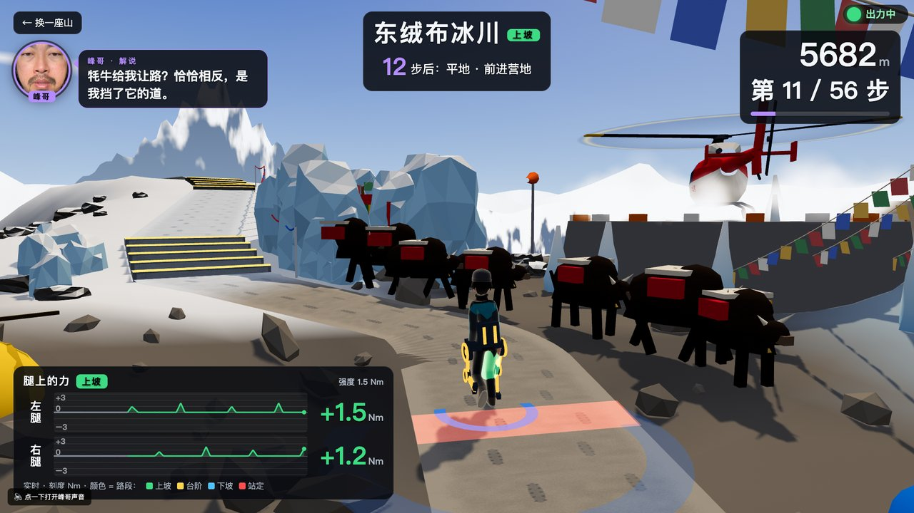
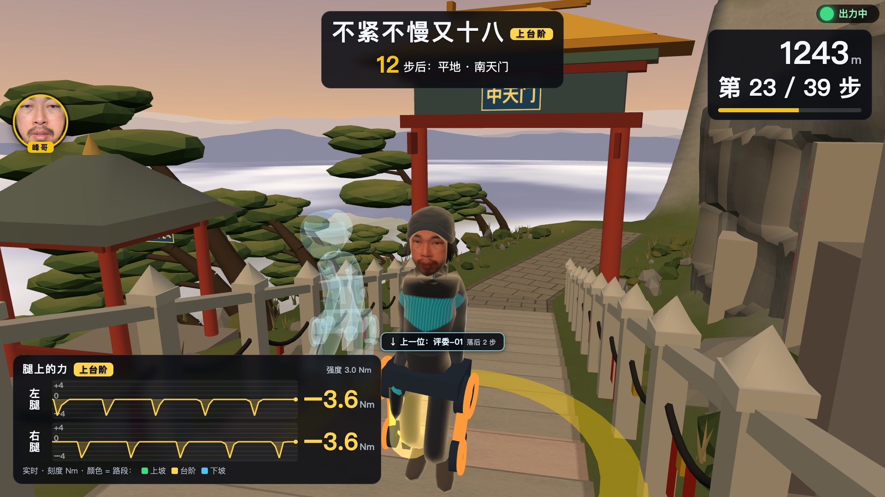
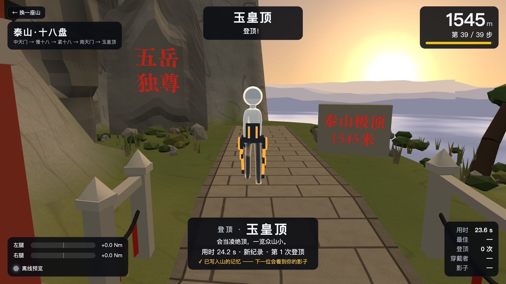
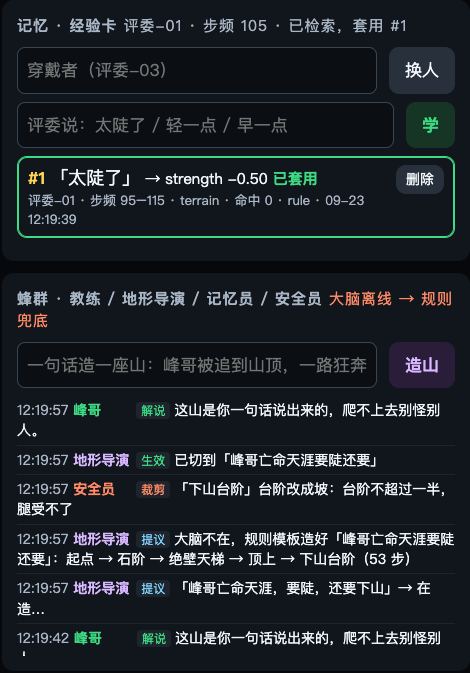
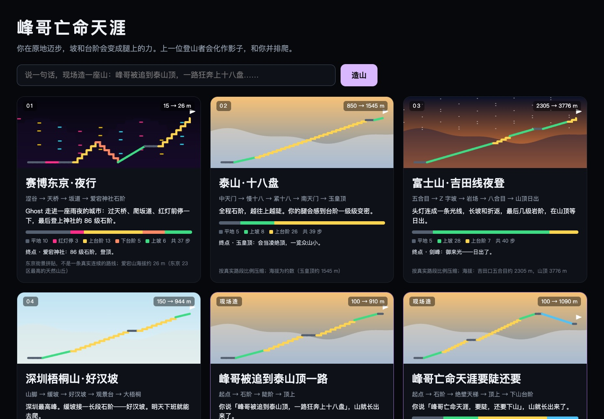

# 峰哥亡命天涯（控制软件：ShellOS）

> EvoTavern 进化酒馆黑客松 · 深圳站 · 01 具身与穿戴硬件赛道（SHELL FORGE）
> 设备：Hypershell X MaxS 髋关节外骨骼（黑客松专用固件 2.9.99.1）
> 仓库：https://github.com/QiuQiuNB666/aima
> 口径约定：数字后面标来源——「真机」= 9/22 现场实测，「回放」= 用 9/22 真机录制离线跑，「模拟」= 没有硬件时的模拟外骨骼，「单测」= 仓库里的自动测试，「文献」= 论文，「待 9/24 上午实测回填」= 还没在真机 / 真大模型上验过。**展位参数**：启动参数 `./run-mac.sh --ctl terrain --stepping --cap 4 --strength 3.0 --width 16 --http 8765`（软限 4 Nm、强度 3.0、脉冲底宽 16%，原地踏步模式；换人 / 演示复位回到这组值），下文力矩数字都按这组算。没标的是设计决定。
> 游戏原名「山的记忆」，9/23 改名「峰哥亡命天涯」；「山的记忆」保留为经验继承那一层的名字。
> **9/24 凌晨的变化**（本文已按此改）：珠峰改「惊险优先」——北坳横梯过冰裂缝、大风口刀脊、北壁贴壁横切，56 → 67 步，横梯上走太快会失足；直升机只保留为峰哥「亡命小飞机」梗、只在大本营降落一次；峰哥换成新低多边形身体，每张地图一套穿搭；追兵「捷风」换成峰哥的助理「小 B」（AvatarSample_B（VRoid 官方样例，VRoid 样例条款：可免费再分发、免署名））；跑酷追兵改成四脚机甲，加免手换道（抬膝保持 0.3 s）；东京改成攻壳致敬版（5 个彩蛋，致敬不复刻）；操作台和选山页重设计；导游稳定性（声道仲裁、自动播放解锁、状态机）；展位一键启动见 [展位启动清单](展位启动清单.md)。

---

## 一句话

现在的 VR、体感、跑步机游戏都只有视觉反馈——画面加手柄震动，腿是空的，几乎没有人做物理反馈；**我们做的就是登山走路的物理反馈**：穿上一台量产的消费级髋外骨骼原地迈步，屏幕里的你在爬珠峰北坡，坡和台阶变成腿上真实的阻力和助力（上台阶阻力、下台阶助力 + 落阶冲击；软限 4 Nm，安全员是硬代码）。游戏是载体，主角是外骨骼控制软件 **ShellOS**——官方 App 禁了这个型号，控制层从串口起全是我们自己写的；你说一句「太陡了」，四个角色组成的蜂群当场改手感、存成经验卡传给下一个人，再说一句话，大模型现场造一座山。登顶时，峰哥在旁边来一句。

峰哥口吻版：「VR 只骗眼睛，这玩意儿骗腿，这是个好事儿啊。」展开成三层：① 市面上的 VR / 体感 / 跑步机游戏，反馈只有画面和手柄震动，腿是空的；② 我们用髋外骨骼把屏幕上的坡度和台阶变成腿上真实的阻力和助力，按步态相位打力矩脉冲；③ 游戏是载体，ShellOS 是主角。

## 1. 做了什么

一套跑在笔记本上的**外骨骼主机端控制栈 ShellOS**，一个给观众看的**登山游戏「峰哥亡命天涯」**，外加一层 **Agent 蜂群**：

| 你看到的 | 背后是什么 |
|---|---|
| 大屏上一座 3D 山：**主打珠峰北坡**（展位缺省世界，67 步，惊险优先：北坳横梯过冰裂缝、大风口刀脊、北壁贴壁横切），还能换赛博东京（攻壳致敬版）/ 泰山十八盘 / 富士山吉田线 / 华山长空栈道 / 深圳梧桐山好汉坡 + 两个训练场，共 8 个世界 | 世界是一份 JSON：路段（平 / 上坡 / 下坡 / 上台阶 / 下台阶 / 红灯）+ 主题；地形控制律和游戏读同一份 |
| 你原地迈一步，化身往上走一步；上坡被「推」一下，上台阶腿发沉，下台阶落脚往下一沉 | 步态估计器从髋角算出相位，每接住一个完整步态周期，化身前进一步；控制律按路段在这一步的相位上打梯形髋力矩脉冲 |
| 化身是峰哥：低多边形身体，进哪张图穿哪套（珠峰红色连体羽绒服 + 护目镜 + 氧气面罩 + 冰爪，华山冲锋衣 + 安全带，东京雨衣 + 反光条，泰山朱红短袖 + 遮阳帽……7 套） | P 线 `game/fengge/body.js` 按骨骼现摆的身体，蒙皮到同一套骨骼，动作照用；`outfits.js` 按主题自动换 |
| 走在你前面指路、在梯脚等你的二次元助理「小 B」 | VRoid 官方样例 AvatarSample_B（VRoid 官方样例，VRoid 样例条款：可免费再分发、免署名） + three-vrm（MIT），只读 `/state`、不碰控制；`?npc=0` 关 |
| 大屏左下「腿上的力」：左右腿各一条 6 s 滚动波形，颜色 = 路段 | 画的是 Guard 实际发给电机的力矩指令（`/state` 的 `safety.sent`），不是动画 |
| 跑酷 `/parkour`：步频就是跑速，高抬腿 = 跳，下蹲 = 滑铲，抬一条腿保持 0.3 s = 往那边换道；一台四脚机甲在后面追 | 同一套步态估计 + 地形脉冲（经 `/terrain/force`，带 1 s 过期）；跳 / 滑按路程参数化，滞空正好一个步态周期 |
| 旁边半透明的影子（展位上想让它是峰哥本人：上午请他在珠峰爬一圈） | 上一位登山者这一圈每一步的时刻，登顶后自动成为下一位的影子 |
| 你说「太陡了」，卡片滑入，下一步变轻；删掉卡片，回到原样 | **蜂群**：教练提议参数差值 → 记忆员对照已有经验 → 安全员裁剪或否决 → 生效，存成经验卡；按步频检索给下一个相似的人 |
| 你说「峰哥被追到泰山顶，一路狂奔上十八盘」，几秒后一座新山出现，马上能爬 | **一句话造一座山**：地形导演（大模型）出路线草稿 → 安全员硬代码裁剪 → 套现成画面风格 → 注册成新世界并切过去 |
| 进图先听峰哥当导游讲这座山；登顶、遇红灯、造出新山、过横梯时，峰哥口吻来一句「这是个好事儿啊……」 | **导游**是固定话术 + 预生成峰哥音色（一迈步就打断）；**峰哥解说**：大模型按峰哥口吻现写一句；大脑不在就从内置语录里挑 |
| 操作员仪表盘 | 曲线、相位、安全状态、参数、经验卡、**蜂群时间线（每一步的提议 / 同意 / 裁剪 / 否决 / 生效）**、急停 |

## 2. 蜂群：四个角色，一条时间线

名字有个巧合：峰哥当年合伙的公司就叫「蜂群文化」。

| 角色 | 谁来当 | 做什么 | 大脑不在时 |
|---|---|---|---|
| **教练** | 大模型（Claude；没 Claude key 时 MiniMax-M3） | 评委一句话 → 参数差值提议（结构化输出，参数名只能从当前控制律的参数里选；ShellOS 再把每个参数一次的改动裁到它范围的 15% 以内） | 规则表（卡片来源标 `rule`） |
| **地形导演** | 大模型（同上） | 一句话 → 路线草稿（路段、步数、地名、从 5 种现成画面风格里选一种） | 关键词模板（世界说明里写「规则模板」） |
| **记忆员** | 代码 | 对照同步频段已有的经验卡：同向几张、反向几张；反向照样写新卡，检索时取平均 | —（本来就是代码） |
| **安全员** | **硬代码，故意不交给大模型** | 力矩类参数不许超过软限（超了裁到软限）；30 s 内同一个参数最多改 3 次（防几个人来回拉锯）；急停中一律否决。造山：起步必须是平地（不是就补 2 步）、台阶不超过总步数一半（多了从后往前改成坡）、红灯最多 2 个且每个 1 步、单段 ≤20 步、总长压到 20–80 步、不认识的路段类型直接丢掉 | —（本来就是代码） |
| 峰哥（导游开场） | **固定话术，不走大模型** | 进每张地图、按 R2 之前讲这个景区 | —（本来就是固定的） |
| 峰哥（解说） | 大模型（同上） | 登顶 / 红灯 / 造山时一句峰哥口吻的话，后台线程调，不卡控制循环 | 内置语录（标 `canned`） |

**为什么安全员不用大模型**：会伤到人的那一道闸必须是可预测、可测试、100% 复现的。大模型负责「听懂人话」，安全员负责「不管听成什么都不许越线」。两者之间是单向的：大模型的输出只是提议，安全员说了算；再往下，Guard 还有一道独立的力矩软限和斜率限，大脑进程整个挂掉也不影响腿上的安全链路。

**已有的证据（单测，不打真 Claude）**：`tests/test_swarm.py` 4 条——
- 连说「没感觉」把强度推到软限后，第 3 句「再强一点」被安全员裁成 0、不生效；30 s 内第 4 次改同一参数被否决；急停时一律否决
- 假装 Claude 提议 `strength +9.0` 外加一个不存在的参数：只剩 `strength +0.45`（范围 3 × 15%），假参数被丢掉
- 断网造山：规则模板出的山能走、起步是平地、画面风格是现成的
- 断网时登顶 / 红灯，峰哥用内置语录说话

`shellos/worlds/gen.py` 自检：一份恶意草稿（9 段各 999 步的台阶 + 4 个 5 步红灯 + 一个不存在的「lava」路段 + 不存在的画面风格）被裁成总长 ≤80 步、红灯 ≤2、台阶不过半、全是合法路段、风格退回默认的一座山。

**大模型是哪个**：大脑进程用官方 anthropic SDK，凭据顺序 Claude > MiniMax（同一个 SDK 把 base_url 换到 MiniMax 的 Anthropic 兼容接口）> 没有就兜底；`/health` 和蜂群时间线里写着当下是哪个模型。**截至 9/23 下午还没有 Claude key，实测的是 MiniMax-M3**（C 线）：
- 教练：23 句参数 23/23、方向 23/23（规则表也是 23/23）；加试 7 句 7/7（规则表 3/7）；延迟 p50 1.6 s、p95 2.8 s
- 造山：10 句 10 句都由模型生成，被安全员裁剪的 2 句（其中一句「500 步 + 5 红灯」是故意刁难）；p50 7.0 s、最长 10.0 s
- 峰哥解说：0.9–2.2 s
- Claude 在线时的同样数字：等拿到 key 再测
仪表盘经验卡上显示的是大脑当下的模型名（现在是 MiniMax-M3），规则兜底的卡显示 `rule`；数据文件里 `source` 字段的 `claude` 只是内部键。

## 3. 为什么做

**痛点（市场洞察）**：VR / 游戏里的「腿」是空的。消费市场上的腿部触觉只有振动（bHaptics 脚部 ERM）、电刺激（Teslasuit EMS/TENS）和位移平台 / 滑动鞋（KAT、Cybershoes——后者 2025 年停业），**没有一款消费设备能在腿上给主动力矩**。学术界做过腿部地形力反馈，但要么装在固定平台上（Holotron），要么是地板 / 踝平台 / 龙门架（PreloadStep、Haptic Ankle Platform、HaptX ForceBot），都不能穿着走。

**机会**：Hypershell 这类消费级髋外骨骼已经量产（官方口径 2025 年出货 >3 万台），本身就有两个电机、髋角编码器和腰部 IMU——它就是一台现成的「腿部力反馈外设」，只是没人这样用过。我们检索了中英文、GitHub、B 站 / 知乎，**把 Hypershell 或同类消费外骨骼改成 VR / 游戏外设：零结果**。

**和出题方的方向一致**：Hypershell 创始人公开讲过「外骨骼是人与物理世界的可编程接口」「终态是用户觉得眼前的山变矮了」。我们做的是这个接口上的**应用层 + 记忆层**：不替代它的助力算法，而是给它加上「地形」和「只属于这个人的偏好」。（黑客松固件把原厂助力换成了直接力矩接口，所以今天腿上只有我们的指令；放进产品，这一层应当叠在原厂算法之上。）

**AI 游戏交叉**：一句话造关卡本身不稀奇，稀奇的是造出来的关卡**直接变成腿上的力**——所以必须有一道硬代码的安全员挡在大模型和人之间。

**受众**：
- 游戏 / VR：腿部力反馈外设（登山、楼梯、红灯停这类「只有腿能感到」的交互），关卡能一句话现造
- 健身：原地踏步爬名山，每次的用时和影子都记下来
- Hypershell 户外用户：「山的记忆」——爬过的山、自己的强度偏好随人走
- 我们**不做医疗器械定位**（这是非医疗消费设备）；康复步态训练游戏化只作为远期方向提

## 4. 新在哪（三层同时成立，缺一不可）

先说清楚**不是**新的：给腿做力反馈模拟地形有先例，主动力矩渲染楼梯 / 斜面也有先例（Holotron，2020）。3D 化身同步很常见。大模型生成游戏关卡也不新。

| 层 | 先例 | 我们 |
|---|---|---|
| 穿戴式、可走动、无地面装置 | Holotron 挂在 Stewart 平台上；Kinethreads（UIST 2025）可走动但没做地形 | **是** |
| 髋单关节 + 按步态相位定时的力矩脉冲 | 康复领域有相位脉冲（McGrath & Sergi, ICORR 2019），没有用在 VR / 地形上 | **是** |
| 消费级量产外骨骼当地形外设 | 未检索到 | **是** |
| Agent 层：一句话调手感 / 造关卡，经验继承 + 影子 | — | 软件层，可讲：蜂群 + 硬代码安全员 + 删卡回退 |

**与 Holotron 对比**（最接近的先例）：

| | Holotron（德，2020–2022） | 峰哥亡命天涯 / ShellOS |
|---|---|---|
| 形态 | 髋 + 膝各 2 电机，挂在 Stewart 平台上 | 穿在身上的髋外骨骼，原地踏步即可 |
| 力矩 | 上限 150 Nm | 固件硬限 ±7.5 Nm，我们展位软限 4 Nm |
| 阶段 | 原型，未量产 | 消费级量产硬件 + 开源主机端软件 |
| 地形 | 楼梯、踏石、斜面 | 上坡 / 下坡 / 上台阶 / 下台阶 / 红灯停；世界由 JSON 编辑，也能一句话现场生成；另有跑酷（跳 / 滑铲） |
| 学习 | 未见 | 一句话经验卡 + 按步频检索 + 删卡回退；影子继承 |

**科学依据**（文献）：上坡时支撑力矩增量主要来自**早支撑期的髋伸肌矩**（Lay 2006）；+9° 坡髋正功比平地翻倍以上（Montgomery 2018）；早支撑髋伸脉冲可以改变推进冲量（McGrath & Sergi, ICORR 2019）。所以「上坡 = 早支撑一个伸展脉冲」「上台阶 = 更大的伸展 + 摆动期帮抬腿」。

**我们不说的话**：不说「首个腿部力反馈 / 首个 VR 外骨骼」；在 2AFC 实验做完之前不说「用户能分辨坡度」；不说「Hypershell 官方开放接口」（我们用的是黑客松专用固件 + 现场发的串口协议）；蜂群时间线里的模型名不是 Claude 时不说「这是 Claude 想的」（现在实际跑的是 MiniMax-M3）。

## 5. 怎么做：技术架构

```
┌────────────────────────────────────────────────────────────────────┐
│ 5 Agent 蜂群     教练(大模型) · 地形导演(大模型) · 记忆员(代码) · 安全员(硬代码) │
│                  · 峰哥解说(大模型)；大脑不在 → 规则表 / 模板 / 内置语录        │
│                  经验卡（JSON 行）→ 按「控制律 + 步频区间」检索 → 删卡回退      │
├────────────────────────────────────────────────────────────────────┤
│ 4 界面           登山游戏 /game（Three.js 本地，离线可用）· 选山 / 造山 /worlds │
│                  操作员仪表盘 /（含蜂群时间线）· 标准库 HTTP，/state 10 Hz      │
├────────────────────────────────────────────────────────────────────┤
│ 3 控制律         terrain（主）· puppet（共驾）· dofc · phase · constant · transparent │
│                  只输出「期望力矩」，从不直接碰串口                          │
├────────────────────────────────────────────────────────────────────┤
│ 2 步态估计       极角相位 φ = atan2(−k·ω, θ−θ̄) · 周期接受 · 步频 · 置信度    │
├────────────────────────────────────────────────────────────────────┤
│ 1 安全层 ★       Guard：唯一写串口的地方（见第 6 节）                        │
├────────────────────────────────────────────────────────────────────┤
│ 0 设备           真机串口 · 模拟外骨骼 · 录制回放（同一接口，上层无感）       │
└────────────────────────────────────────────────────────────────────┘
              ▲ 183 Hz 数据帧（髋角 / 角速度 / 腰部 IMU）   ▼ T,左,右（100 Hz）
        Hypershell X MaxS · 黑客松固件 2.9.99.1 · USB 串口 3 Mbps · ±7.5 Nm 硬限

   大脑进程 brain/claude_brain.py（官方 anthropic SDK · claude-opus-5 · 结构化输出）
   ── 跑在能连 Anthropic 的机器上，展位 MacBook 经 SSH 反向隧道访问 127.0.0.1:8790 ──
```

**线程**：设备线程 183 Hz（真机）→ 控制线程 100 Hz（步态更新 → 控制律 → Guard）；手柄线程 100 Hz；HTTP 服务；大模型按需、秒级，**永远不在 100 Hz 循环里**。真机实测控制循环最大间隔 12 ms，一拍计算 <1 ms（真机）。

**为什么大脑是单独的进程**：anthropic SDK 要 Python ≥3.10，展位 MacBook 是 3.9，ShellOS 坚持零新依赖；MacBook 直连 Anthropic 返回 403。所以大模型（Claude 或 MiniMax-M3）只在大脑进程里调，MacBook 借 SSH 反向隧道用它。大脑连不上之后 20 s 内不再重试，免得每句话都等超时；超时上限：教练 12 s、峰哥 15 s、造山 90 s（代码）。

**铁律**：只有 Guard 写串口；游戏和仪表盘只读 `/state`、只发动作；每一层都能单独砍掉而系统照跑——大脑整个拔掉，游戏、腿上的力、经验卡都照常工作。

### 5.1 地形控制律（terrain）

相位约定：脚跟着地 = 0%（文献约定）。梯形脉冲，底宽 10–20% 周期。

正 = 伸展、负 = 屈曲（仍是 9/22 数据推断）。峰值按展位强度 3.0 算（`terrain.py` 的 MULT / SWING / IMPACT × 强度，代码直接算出来的）：

| 路段 | 手感 | 脉冲 | 峰值（强度 3.0） | 位置 / 底宽（展位 16%） | 依据 |
|---|---|---|---|---|---|
| 上坡 | 有人在后面推 | 早支撑伸展 | +3.0 Nm | 11% / 16% | 文献（Lay 2006；Montgomery 2018） |
| 下坡 | 腿被拖住 | 早支撑制动 | −2.4 Nm | 10% / 16% | 推断 |
| 上台阶 | **腿发沉、一级一级费劲蹬**（阻力） | 支撑期往屈曲拉；**摆动期不压腿** | −3.6 Nm | 6% / 16% | **9/23 球球穿真机后的反馈**：上楼要阻力，不是助力 |
| 下台阶 | 落脚往下一沉，然后被扶着迈下去 | 脚跟着地落阶冲击 + 早支撑伸展助力 + 摆动期帮迈腿 | −3.0 / +3.0 / −2.4 Nm | 0%（底宽 10%）/ 14% / 68%（16%） | 同上，和上台阶一起反过来 |
| 红灯 | 走着被轻拉、位置不前进；两腿站稳 1.5 s 放行 | 早支撑制动 | −1.5 Nm | 10% / 16% | 设计 |
| lift（跑酷起跳） | 帮着抬腿 | 只在摆动期屈曲 | −2.4 Nm | 68% / 16% | 设计 |

上台阶以前是「伸展 + 摆动期帮抬腿」（依据是上坡的文献），9/23 球球穿上真机爬了之后反馈「上楼应该是阻力」，改成了现在这样。**摆动期不压腿**是故意的：抬腿时往下压会让脚尖勾到台阶。上坡没改，还是推；要不要也改成阻力，9/24 上午再试。
五种路段在强度 3.0、软限 4 Nm、底宽 16% 下重跑了自动核对（`scripts/pulse_plot.py`）：梯形、底宽 10–20%、30–90% 不出伸展力矩（防绊）、无方向突变、峰值 ≤ 软限；27 组参数边界扫描 0 组不过（模拟，9/23 下午）。控制律自己也把输出裁在软限以内，不全靠 Guard；落阶冲击再经 Guard 的 50 Nm/s 斜率限制，指令最快 60 ms 才能从 0 爬到 3 Nm（代码注释：削成约 60 ms 的顿挫，不是尖刺）。现场造出来的山用的是同一套路段和脉冲，没有新的力矩形状。

### 5.2 步态估计

用 12 段 9/22 真机录制（7 段可用）扫了 1080 档门限（`scripts/gait_audit.py`）。改后默认（回放）：
- 穿戴时坐 / 站 / 坐站**假周期 13 → 0**，网格相邻档也都是 0
- 唯一像样的走动段覆盖率 **0.25 → 0.44**（被接住的步 / 实际步）
- 步频中位 108 步/分（P10–P90 77–125）
- 手段：半周期锁存（去掉一步被切成两段）+ 两腿同相检查（坐站时两腿同相）+ 周期区间 0.8–2.2 s

### 5.3 经验卡闭环（「闭环学习」得分项）

- **一句话改参数**：评委说「太陡了」→ 教练提议 `strength −0.5` → 记忆员对照 → 安全员放行 → 立即生效
- **存成卡**：`{穿戴者, 控制律, 触发条件（步频 ±10）, 参数差值, 原话, 置信度, 命中次数, 来源 claude/rule}`，存 `data/experiences.jsonl`
- **下一个人自动继承**：换人后步态重新估计，走满 6 步、步频稳定后按「同控制律 + 步频区间」检索，命中就套用，事件流出现「命中经验 #n」
- **删卡回退**：删掉一张已套用的卡，参数立即反向回退——这是「不是写死的剧本」最直接的证明；点「恢复」卡片重新参与检索
- **影子**：每圈登顶，这一圈每一步的时刻成为下一位的影子；换人 / 演示复位不清影子、不清经验库

对应评分表「Agent 架构」：记忆 = 经验卡库 + 记忆员；规划 = 教练把一句话翻成参数差值、地形导演把一句话翻成路线；工具调用 = 控制律参数 / 地形 / 世界注册；幻觉控制 = 参数白名单 + 幅度裁剪 + 硬代码安全员 + 规则兜底。

### 5.4 峰哥解说与峰哥头

- 触发：登顶（带用时、是否破纪录）、进红灯（同一趟 20 s 内只说一次）、造出新山。大模型按峰哥口吻写一句 ≤30 字的话（辩证反转：「这是个好事儿啊」「恰恰相反」）；提示词明确不碰两性、政治、真实私事，不冒充他本人讲经历
- 兜底：内置语录（每类 2–4 句），仪表盘标来源 `claude` / `canned`
- 显示：仪表盘蜂群时间线；大屏左侧峰哥头像 + 解说气泡（新的一句弹出、停 6 s）；化身峰哥（P 线 9/24：放样几何头 + 照片正投影，**新的低多边形身体**按骨骼现摆、蒙皮到同一套骨骼，偏瘦窄肩、约 1:6.5 头身，有指骨的手能伸手扣锁；**每张地图一套穿搭**，按主题自动换：珠峰红色连体羽绒服 + 护目镜 + 氧气面罩 + 冰爪 / 华山冲锋衣 + 安全带 / 东京近黑雨衣 + 反光条 / 泰山朱红短袖 + 小背包 + 遮阳帽 / 梧桐 T 恤短裤 + 水壶 / 富士抓绒 + 头灯 / 训练场白衬衫；不带任何品牌标；跟拍镜头在身后，按 V 或加 `?cam=front` 切正面镜头才看得到脸）。游戏地址加 `?fengge=0` 关掉头像、气泡和贴脸
- 语音：用 MiniMax 快速复刻了峰哥音色，参考音频是 github.com/YeJe-cpu/talk-to-fengge（Apache-2.0）里约 45 秒的公开直播片段（复刻时这段参考音频上传给了 MiniMax）。11 句兜底语录已经预生成成峰哥音色，断网也能出声；Claude 现场写的新台词实时合成，实测一句 4.2 / 7.8 / 10.2 s；MiniMax 失败退回 macOS `say`（女声），再不行就静音。只念当前这一句解说，不接收任意文字。合成出来的音频只存在本机（`data/voice/` 不进 git），不公开发布。游戏地址加 `?voice=0` 静音；峰哥开关关掉（`?fengge=0`）的场次要同时加 `?voice=0`
- 导游开场（G 线）：进每张地图、按住 R2 之前，峰哥头像放大当导游讲这个景区，镜头从正面推近再翻到身后。**固定话术，不走大模型**（8 个世界共 50 句，事实只写拿得准的，比如十八盘一千六百多级、1975 年中国梯、南峰 2154 米）；预生成峰哥音色，每张图约 25–32 s；一迈步或按 R2 立刻打断（实测 240 / 308 ms）；`?guide=0` 关。**稳定性（G 线 5 轮，9/24）**：峰哥所有声音走一条声道仲裁（`voice_bus.js`：导游 > 地标 > 事件，同一时刻只放一段）；浏览器没解锁自动播放时不再哑着讲完，出「按任意键开启峰哥声音」、第一次按键解锁并预热片段；开讲条件写成状态机（armed / playing / done）：每位新穿戴者恰好讲一次，急停 / 菜单 / 走动立刻停且不重讲；语音全部预加载有结果才开讲，卡住按播放进度兜底；启动时校验语音缓存，缺的后台补
- 素材：峰哥照片来自 github.com/w466747380/talk-to-fengge-live（MIT）；口吻节选自 github.com/YixiaJack/feng-ge-skill（MIT）；音色的参考音频来自 github.com/YeJe-cpu/talk-to-fengge（Apache-2.0）。**峰哥本人 9/23 在现场当面口头同意本次黑客松展示使用他的肖像、口吻和 AI 复刻声音**（球球在场，记在指挥板）；开源许可证管的是仓库里的代码和文件，管不了一个真人的肖像和声音，所以另外当面问了他本人。他改主意就用 `?fengge=0&voice=0` 把头像、贴脸、气泡和峰哥音色一起关掉。素材清单见 [素材授权](素材授权.md)

### 5.5 峰哥的助理「小 B」（占位名，球球或 anni 定了再改）（J 线；9/24 起替代追兵「捷风」）

- 走在你前面指路、到台阶就退到路中线后方、到中国梯在梯脚等你，待机时有小动作；只读 `/state`，不碰任何控制接口；`?npc=0` 关
- 角色：VRoid（pixiv）官方样例 **AvatarSample_B**（**VRoid 样例条款**：可免费再分发、免署名，不得改标 CC0、不得收费分发；紫色长双马尾、运动外套 + 粉短裙，街头风），文件瘦身到 7.4 MB；装载用 **three-vrm**（MIT，本地 vendor）；待机 / 走 / 跑三条动作是从 three.js 仓库自带的 Xbot 里剥出来的 Mixamo 动画，重定向到 VRM 骨骼。`?npcvrm=<id 或文件名>` 可换另外 7 个候选（许可见 `models/assistant_q/LICENSE.txt`），名字用 `?npcname=` 临时改
- **为什么换掉捷风**：捷风是《无畏契约》角色，IP 属于 Riot，模型是粉丝手办，我们没有授权——公开仓库和展位都不该靠它；而且方向从「追兵」改成了「峰哥的助理」。捷风的 STL、录音和代码仍在仓库里（`?npc=jifeng` 可看），标为已弃用，只作对照，不上展位、不上海报（见 [素材授权](素材授权.md)）

### 5.6 珠峰北坡（主打）、跑酷、大屏新 HUD

- **珠峰·北坡 · 展位主打**（9/23 定；main 44af196 起缺省世界、演示复位、开始界面都落在珠峰；东京等其余地图是「还能换一座山」。专项设计见 [`docs/珠峰-架构.md`](../珠峰-架构.md)）
  - **惊险优先**（9/24 凌晨，球球：「最好是在悬崖峭壁上走，加一个搭梯子过悬崖的环节」）。路线（67 步，海拔 5200 → 8848.86 m）：大本营 → 东绒布冰川 → 前进营地 → 北坳冰壁 → **北坳裂缝·横梯**（两架绑接的铝梯横跨冰裂缝，镜头压到腰高看脚下；**走太快（步频 > 110）或在梯上站太久会晃，连续 2.5 s 就失足黑场、计一次「失足」**）→ **北坳营地·吸氧（红灯）** → 北山脊 → **大风口·刀脊**（1 m 宽的路面，两侧 60° 陡坡、左侧雪檐，脚下雾带 + 滚石）→ 第一台阶 → **北壁横切·贴壁栈道**（1.4 m 岩檐，右边灰岩壁、左边深渊）→ **第二台阶·排队上梯（红灯）** → 中国梯 → 顶峰。按爬升比例压缩；为了加刀脊和横切中段拉长了，海拔读数北坳一带低约 200 m、第一台阶 / 横切一带低 300–500 m，大风口约 7500、顶峰对得上（卡片上写着）；北坳上架梯过裂缝是真有的（有些年份没有），刀脊和栈道为了惊险感收窄、加陡了；中国梯 1975 年架设，2008 年原梯收进博物馆；排队放在第二台阶梯子下，因为北坡公认的堵点就在这里（E 线，按新华社 / 澎湃 / 中国日报等交叉核对）。**失足的处理**：只有黑场和计数，腿上的力不变、位置不回退（化身位置归引擎步进器）
  - 腿上的力都有画面理由：冰川 = 上坡推一把，北坳冰壁、中国梯 = 台阶阻力，北坳 = 吸氧停顿；横梯是平路（不出力），惊险全靠画面和「慢点走」的规则
  - 场景互动（E 线，只动画面和音效，不碰控制）：走近经幡一阵**猛风**，旗子乱飞、啪啪响；**牦牛驮队**在冰川上迎面下山、走近让路；第二台阶**排队**时前面的人一个个往上挪，轮到你时最前面那个人**让一步**；**北坳吸氧**弹出面罩图标、一口嘶——、呼出白气，缺氧暗角松一点；**登顶**时觇标上卷着的红旗展开。风雪、天色、缺氧暗角随海拔变（W 线：天顶随海拔压黑、低多边形云海、白毛风）；声景（M2 线：风、冰爪脚步、路绳、铝梯、喘气、营地）。峰哥地标台词 10 句预生成峰哥音色（横梯：「慢点，一步一档」「过了，这是个好事儿啊」；刀脊：「两边是悬崖？恰恰相反，中间才是路」）
  - **直升机**：考据说北坡禁飞（[珠峰-考据 §8](../珠峰-考据.md)，国家地理、Alan Arnette 等一致）。我们保留一架，**只作为峰哥「亡命小飞机」的梗、只在大本营降落一次**（第一次迈步时从头顶掠过、落到停机坪，峰哥说「坐亡命小飞机来的，这是个好事儿啊」），不上山、不救援、不绕顶。评委问就这么答（题库 D14）
  - 为什么是珠峰：峰哥 2020 年坐小飞机到卢卡拉、徒步 7 天到过尼泊尔一侧的珠峰大本营（他自己频道的系列视频）；造山环节递给评委的那句「峰哥坐亡命小飞机降落卢卡拉，徒步七天到珠峰大本营」就是这段路
  - 峰哥的影子（前提：9/24 上午峰哥本人答应）：请他在珠峰穿上爬一整圈，穿戴者名「峰哥」，之后每位评委都在跟峰哥的影子赛跑。影子是这张图最近一次完整登顶的那一圈，**进程重启就没了，有人登顶就会被换掉**
- **华山·长空栈道**（60 步，玉泉院约 411 m → 南峰 2154.9 m）：青柯坪山路 → 千尺幢 / 百尺峡 / 老君犁沟（两侧直上直下的窄缝）→ 北峰 → 苍龙岭（刀背山脊）→ 金锁关 → **南天门·扣安全锁（红灯）** → 长空栈道（横铺木板，板缝能看见云）→ 南峰。北峰 1614.9、南峰 2154.9（2007 年重测）是硬数字，其余海拔读数只是示意；长空栈道其实是南峰东侧的一条支路，游戏把它串在登顶前，卡片上写明（E2 线）
- **跑酷 `/parkour`**：夜里城市屋顶，3 条道；步频 = 跑速（每步/分 0.075 m/s，100 步/分约 27 km/h，200 步/分封顶约 54 km/h）；一条腿抬过 45° = 跳，两条都过 35° = 滑铲，走满 5 s 才开（阈值只按录制估过，**真机没穿过**）；**免手换道**（`?lane=knee`，9/24）：抬一条腿到高抬腿阈值**保持 0.3 s** = 往那条腿那边换一道（路口 = 往那边转），0.3 s 内落下 8° 仍是跳，两腿放回才能再来，缺省仍是手柄 / 键盘换道；**跳 / 滑按路程参数化**（第 8 轮）：跳长 = 2 步的路程，滞空正好一个步态周期（100 / 150 / 200 步/分滞空 1.22 / 0.82 / 0.62 s，跳长都约 9.2 m），起跳对在 lift 那一拍（自动驾驶 31/44 落在 ±9 ms）；追兵是一台**四脚机甲**（程序生成，不用任何游戏模型；捷风已从跑酷撤掉），撞 3 次结束。腿上的力只走 `/terrain/force`：斜板 = 上坡、落地 0.5 s = 下坡、起跳前 = lift；每次带 1 s 过期、300 ms 续一次，页面失焦 / 关掉 / 崩了 1 s 内自动回自动地形，大小仍归 Guard 和 R2 管（R 线；开发机 1080p 60 fps，5 轮动作 + 8 轮关卡，见 [跑酷-动作调研 §4](../跑酷-动作调研.md)）
- **赛博东京 · 攻壳致敬版**（M2 线，9/24，**致敬不复刻**：全部程序生成，没下载任何模型，不出现原作角色、机体、徽章、笑面男，不用原作音乐）：四脚机甲「ヨンソク-04」趴在天桥检修平台上，看你走近就撑起抬头；港式出挑竖招牌、空调外机、横街垂线、青绿品红霓虹、雨声 + 自己合成的低音垫。**5 个彩蛋**：① 站定 3 s → 峰哥光学迷彩（半透明 + 青色轮廓光，一动就恢复）② 走过坂道「ゴースト」出挑牌 → 故障字幕 0.6 s ③ 登顶 → 拝殿前浮现「2029」+ 两记合成太鼓 ④ 贩卖机罐子贴「電脳メンテナンス液」⑤ 机甲看人抬头。都只看化身位置，不碰控制
- **操作台与选山页重设计**（D 线，9/24）：操作台第一屏 = 安全（急停最上、最大、最红）+ 记忆（换人 / 评委说 / 经验卡删 / 恢复）+ 蜂群（造山框 + 时间线）+ 地形，顶栏三个灯：大脑（在线 / 离线兜底 / 没 key）、峰哥语音来源、手柄 R2；选山页珠峰排第一、占两格、标「主打」，方向键选卡、Enter 进入、`/` 跳到造山框。安全按钮一个没删、行为没改
- **展位一键启动**（B 线）：启动参数、SSH 隧道、大脑、语音缓存校验、两块屏怎么开、换人 / 复位、出问题怎么办，全在 [展位启动清单](展位启动清单.md)
- **步频上限**：一步最短 0.8 s → 0.6 s，能认到 200 步/分（跑起来不再被拒）；回放穿戴假周期仍是 0
- **大屏新 HUD**（U 线）：左下「腿上的力」波形；右下 AI 决策卡（评委那句话 → 教练 → 记忆员 → 安全员，一行一个角色亮出来，**裁剪橙底、否决红底、生效绿字**）；造山时全屏「AI 正在造山…」过场，新山剖面逐段画出来；状态流：待机（45 s 没人动，轮播玩法 + 二维码）→ 准备（大字「按住 R2 开始」）→ 游戏中 → 登顶成绩卡（至少停 8 s，和影子比、经验卡号、二维码）；右上安全灯任何状态都在，急停压过一切

## 6. 安全设计

外骨骼的力矩加在人身上，安全是第一层而不是最后一层。

| 规则 | 值 | 为什么 |
|---|---|---|
| 唯一出口 | 只有 `shellos/safety/guard.py` 能写串口 | 任何上层 bug（包括大模型）都绕不过去 |
| 软限 | 展位 4 Nm（`--cap 4`；代码缺省 3 Nm；固件硬限 7.5 Nm 永远不用满） | ≈0.05 Nm/kg（按 75 kg），低于文献髋外骨骼扰动实验最低档 0.08 Nm/kg |
| 斜率限 | 50 Nm/s | 文献建议 ≤150 Nm/s；梯形脉冲，不出方波 |
| 死人开关 | 手柄 R2 / 本机网页按钮（/ 键盘空格，需 --hotkeys），多来源取最大；按一半力就一半；松开 → 力矩归零 | 真机上默认没人按就没有力 |
| 步态置信度门控 | 置信度 <0.5 → 力矩 0 | 站着不动、坐下、乱晃时不出脉冲 |
| 看门狗 | 100 ms 没收到控制拍 → 发 0；1 s → DISABLE | 固件本身 100 ms 不续发也会清零，这是第二道 |
| 断流 | 数据流 200 ms 没更新 → 0 | |
| 急停 / 退出 | 手柄 ×、网页急停（/ Esc，需 --hotkeys）、进程退出、异常 → 必 DISABLE；急停后必须手动重新上膛 | |
| 安全员（Agent 层） | 大模型提议的力矩参数超软限就裁；30 s 同参数 ≤3 次；急停全否；造山路线硬裁剪 | 大模型再怎么输出，腿上也只会出现本来就核对过的脉冲 |
| 只认本机 | 所有 POST（死人开关、急停、换人、造山、改参）只接受 MacBook 本机，局域网一律 403 | 大屏可以放在另一台设备上看，但不能动 |
| 强制死人开关 | `--force-deadman` 只允许配合 `--sim` / `--replay`，真机启动直接报错 | 防止测试参数带进真机 |
| 共驾（puppet） | 满杆 2 Nm、缓升 ≥300 ms（代码）；单段 ≤10 s（操作规程）；**被控者只能是队友，不上评委** | 文献里「人控人」的实验都有知情同意和安全带 |

9/22 真机上安全层工作过：两次 DISARMED 都是主机卡顿触发看门狗（真机），之后把 DISABLE 门限定为 1 s。单测覆盖软限、斜率、死人开关、急停、看门狗、安全员等规则。

## 7. 验证计划与已有数据

**已有**（截至 9/23）

| 项 | 结果 | 来源 |
|---|---|---|
| 串口握手、数据流、力矩下发 | PING → VERSION → ENABLE；183 Hz；力矩指令被接受（OK,T 323 条） | 真机 9/22 |
| 控制循环 | 最大间隔 12 ms，一拍 <1 ms | 真机 |
| 步态假周期 | 穿戴坐 / 站 13 → 0 | 回放，7 段 |
| 步态覆盖率 | 0.25 → 0.44 | 回放 |
| 脉冲形状核对 | 5 路段全过，边界扫描 27 组 0 不过 | 模拟 |
| 红灯 | 走着不前进且被轻拉；停下 2.0 s 放行（回放复算中位 2.2 s） | 模拟 / 回放 |
| 故障矩阵 | 11 种故障 11 过；12 段真机录制全栈回放 0 DISARM、0 Traceback | 模拟 / 回放 |
| 游戏帧率 | 1920×1080 50–58 fps（开发机 i5-7400 核显） | 模拟 |
| 游戏对控制循环的影响 | loop_ms 中位 14 → 15 ms；p95 +5–9 ms（压线） | 模拟 |
| 蜂群 / 造山 / 解说 | 安全员裁剪、否决、急停全否；恶意路线草稿被裁成能走的山；断网兜底全通 | 单测（不打真大模型） |
| 大模型实连（MiniMax-M3） | 教练 23/23、p50 1.6 s；造山 10/10 由模型生成、p50 7.0 s；解说 0.9–2.2 s | C 线实测 9/23 |
| 台阶手感 | 上台阶助力 → 阻力（球球穿真机反馈） | 真机 9/23，1 人主观 |
| Claude 实连 | — | **等 key** |

**已知局限（照实写）**
- 真机录制只有球球 1 个人，像样的走动约 170 s，而且更像原地踏步
- 真人的步只被接住约 44%，游戏里位置会一顿一顿地前进
- 「正力矩 = 髋伸展」是从数据推断的；「脚跟着地在估计器相位的哪里」（HS_PHASE）证据不够，暂定 0.5
- 下坡用制动脉冲是推断，文献只说下坡主要是膝在吸能
- 手感只有球球一个人 9/23 穿上试过台阶（所以反过来了）；上坡、下坡、红灯、落阶冲击、跑酷的跳和滑铲都还没穿在人身上试
- 规则兜底是关键词匹配：「不累」会被算成减力；大模型在线时才懂这类说法
- 现场造的山只在内存里（最多留 8 座），重启就没了

**9/24 上午真机验证（按顺序，命令见架构 v3 §4）**
1. 力矩方向：+1 Nm 是不是伸展
2. 步态门限：3 人各向前走 ≥30 s，看接受 / 拒绝
3. HS_PHASE：同一批录制跑 `gait_audit.py --hs`，3 人结果接近且离 0.5 超过 0.1 才改
4. 原地踏步相位稳不稳；不稳就 `--stepping`，再不稳改慢走
5. 台阶强度：展位缺省 3.0（上台阶峰值 3.6 Nm）；陌生人穿上再确认「有感觉不难受」，不行就降
6. **2AFC 蒙眼辨坡向**：`afc.py --trials 10`，**≥9/10 才对外说「能分辨」**；做不到就只说「能感到脉冲随地形变化」
7. 游戏上大屏：真机驱动爬一圈，看化身跟腿、loop_ms 正常
8. 大脑在线：仪表盘顶栏大脑灯亮，`/health` 看 backend 是 Claude 还是 MiniMax；教练、造山、解说各试一次，记延迟

## 演示截图

| 珠峰北坡·北山脊大风口：风雪、路绳、排队的登山者，峰哥穿珠峰那套红色连体羽绒服（9/24 凌晨，离线预览） | 珠峰北坡·东绒布冰川：牦牛驮队让路，左下「腿上的力」是实际发出的上坡脉冲（模拟实走） |
|---|---|
|  |  |
| 登山游戏：泰山十八盘上台阶，左下「腿上的力」是实际发出的阻力脉冲（模拟实走，强度 3.0） | 登山游戏：泰山十八盘登顶 |
|  |  |
| **仪表盘**：经验卡 #1 + 蜂群时间线（提议 / 同意 / 裁剪 / 生效） | **一句话造的山**：选山页里的「现场造」卡片 |
|  |  |

游戏两张是 `--sim` 下的离线预览画面（9/23，地图精加工第 2 轮之后；登顶卡上的用时是示例数）。仪表盘和选山页是 9/23 模拟运行的实录，**那次大脑没连，教练走规则表、造山走模板，界面上照实标着「大脑离线 → 规则兜底」**；Claude 在线的版本 9/24 上午补。上台阶力矩图：`截图/脉冲-上台阶.png`。
展位用法见 [4 分钟展位脚本](4分钟展位脚本.md)，问答准备见 [评委题库](评委题库.md)，视频分镜见 [60 秒演示脚本](60秒演示脚本.md) 和 [拍摄分镜表](video_storyboard.md)；打印件：[海报](poster.html)（A1）、[展位一页纸](onepager.html)（A4 正反面）。

## 8. 团队

- **球球**：控制栈、步态、登山游戏、Agent 蜂群、真机调试、展位主讲与操作
- **anni**：开场主持、带评委穿戴、感知实验（蒙眼二选一）负责人
- **艾玛**：声音——音效设计与展位上的声音讲解
- **Penn**（9/24 加入）：珠峰地图与现场真人测试

## 9. 复现

```bash
git clone https://github.com/QiuQiuNB666/aima && cd aima
python3 -m venv .venv && .venv/bin/pip install -r requirements.txt   # Python 3.9+，依赖只有 pyserial / pygame / pynput / pytest
.venv/bin/pytest -q                                                  # 测试永远不打真 Claude（tests/conftest.py）

# 没有外骨骼：模拟外骨骼 + 登山游戏
.venv/bin/python -m shellos.main --sim --ctl terrain --force-deadman
#   浏览器开 http://localhost:8765/worlds 选一座山，或在顶部输入框说一句话造一座山 → /game
#   按住空格走，1/2/3 慢/中/快，R 回山脚；仪表盘 http://localhost:8765/（蜂群时间线、「评委说」输入框）

# 接大模型（可选；不接就走规则表 / 模板 / 内置语录）：ANTHROPIC_API_KEY=Claude，或 brain/.env 里写 MINIMAX_API_KEY
python3 -m venv brain/.venv && brain/.venv/bin/pip install anthropic
ANTHROPIC_API_KEY=… brain/.venv/bin/python brain/claude_brain.py

# 有外骨骼（开机进入工作态，插 Type-C）
.venv/bin/python scripts/probe.py                    # PING → VERSION → ENABLE → 看 3 秒数据 → DISABLE
./run-mac.sh --ctl terrain --cap 2.5                 # 按住手柄 R2 才有力，× 急停，○ 重新上膛
```

详细见仓库 `README.md`；架构全文 `docs/架构-v3-完整版.md`（末节「大脑与蜂群」）；步态审计 `docs/报告/步态审计.md`；脉冲核对 `docs/报告/地形手感.md`。

## 参考

- Holotron：newatlas.com/vr/holotron-virtual-rreality-haptic-exoskeleton/
- Level-Ups, CHI 2015；Infinite Stairs, SIGGRAPH 2017 E-Tech；Haptic Ankle Platform, TVCG 2021（DOI 10.1109/TVCG.2021.3111675）；PreloadStep, IEEE ToH 2023（DOI 10.1109/toh.2023.3275136）；Kinethreads, UIST 2025（DOI 10.1145/3746059.3747755）
- McGrath & Sergi, ICORR 2019（DOI 10.1109/icorr.2019.8779426）——相位定时髋脉冲改变推进
- Lay et al. 2006（pubmed 15990102）；Montgomery 2018（PMC6124028）——上坡髋伸肌矩
- 踝外骨骼助力时序 JND 2.8% 周期（pubmed 35333715）；力矩 Weber 分数 12–19%（pubmed 36343009）
- 踝腱电刺激渲染坡度，Frontiers VR 2024——同一刺激不同人方向解读相反，所以我们坚持做 2AFC
- 峰哥素材：github.com/w466747380/talk-to-fengge-live（照片，MIT）；github.com/YixiaJack/feng-ge-skill（口吻，MIT）
