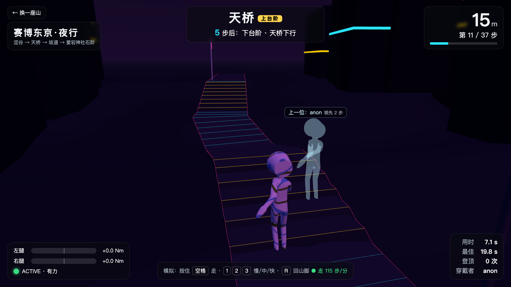
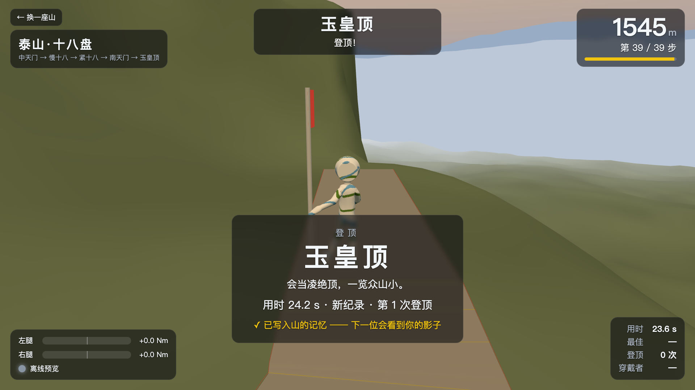
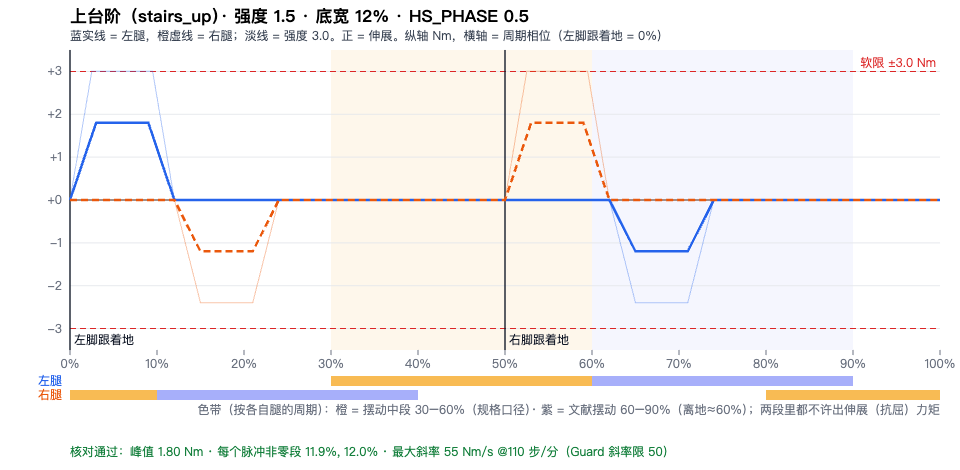

# ShellOS ·「山的记忆」

> EvoTavern 进化酒馆黑客松 · 深圳站 · 01 具身与穿戴硬件赛道（SHELL FORGE）
> 设备：Hypershell X MaxS 髋关节外骨骼（黑客松专用固件 2.9.99.1）
> 仓库：https://github.com/QiuQiuNB666/aima
> 口径约定：数字后面标来源——「真机」= 9/22 现场实测，「回放」= 用 9/22 真机录制离线跑，「模拟」= 没有硬件时的模拟外骨骼，「文献」= 论文，「待真机验证」= 9/24 上午才能确认。没标的是设计决定。

---

## 一句话

**第一个用消费级髋外骨骼做「可走动」的地形力反馈登山：不靠地板、不靠平台，你在原地迈步，屏幕上的你在爬山，坡和台阶由按步态相位定时的髋力矩脉冲「放」到腿上；上一位登山者化作影子和你并排爬，你说一句「太陡了」，这座山就记住你的腿。**

## 1. 做了什么

一套跑在笔记本上的**外骨骼主机端控制栈 ShellOS**，外加一个给观众看的**登山游戏**：

| 你看到的 | 背后是什么 |
|---|---|
| 大屏上一座 3D 山（赛博东京 / 泰山十八盘 / 富士山吉田线 / 深圳梧桐山好汉坡，共 6 个世界） | 世界是一份 JSON：路段（平 / 上坡 / 下坡 / 上台阶 / 下台阶 / 红灯）+ 主题；地形控制律和游戏读同一份 |
| 你原地迈一步，化身往上走一步；遇到台阶，腿上被「推」一下 | 步态估计器从髋角算出相位，每条腿每接住一个完整步态周期，化身前进一步；控制律在这一步的早支撑期打一个梯形髋力矩脉冲 |
| 化身的腿跟你的腿同步摆 | 化身骨骼直接用串口读到的髋角驱动（模拟数据上已跑通，真机待验证） |
| 旁边半透明的影子 | 上一位登山者这一圈每一步的时刻，登顶后自动成为下一位的影子 |
| 你说「太陡了」，卡片滑入，下一步变轻；删掉卡片，回到原样 | Agent 把一句话翻成参数差值 → 立即生效 → 存成经验卡；按步频检索给下一个相似的人 |
| 旁边一台操作员仪表盘 | 曲线、相位、安全状态、参数、经验卡、急停 |

## 2. 为什么做

**痛点（市场洞察）**：VR / 游戏里的「腿」是空的。消费市场上的腿部触觉只有振动（bHaptics 脚部 ERM）、电刺激（Teslasuit EMS/TENS）和位移平台 / 滑动鞋（KAT、Cybershoes——后者 2025 年停业），**没有一款消费设备能在腿上给主动力矩**。学术界做过腿部地形力反馈，但要么装在固定平台上（Holotron），要么是地板 / 踝平台 / 龙门架（PreloadStep、Haptic Ankle Platform、HaptX ForceBot），都不能穿着走。

**机会**：Hypershell 这类消费级髋外骨骼已经量产（官方口径 2025 年出货 >3 万台），本身就有两个电机、髋角编码器和腰部 IMU——它就是一台现成的「腿部力反馈外设」，只是没人这样用过。我们检索了中英文、GitHub、B 站 / 知乎，**把 Hypershell 或同类消费外骨骼改成 VR / 游戏外设：零结果**。

**和出题方的方向一致**：Hypershell 创始人公开讲过「外骨骼是人与物理世界的可编程接口」「终态是用户觉得眼前的山变矮了」。我们做的是这个接口上的**应用层 + 记忆层**：不替代它的助力算法，而是给它加上「地形」和「只属于这个人的偏好」。（黑客松固件把原厂助力换成了直接力矩接口，所以今天腿上只有我们的指令；放进产品，这一层应当叠在原厂算法之上。）

**受众**：
- 游戏 / VR：腿部力反馈外设（登山、楼梯、红灯停这类"只有腿能感到"的交互）
- 健身：原地踏步爬名山，每次爬的用时和影子都记下来
- Hypershell 户外用户：「山的记忆」——爬过的山、自己的强度偏好随人走
- 我们**不做医疗器械定位**（这是非医疗消费设备）；康复步态训练游戏化只作为远期方向提

## 3. 新在哪（三层同时成立，缺一不可）

先说清楚**不是**新的：给腿做力反馈模拟地形有先例，主动力矩渲染楼梯 / 斜面也有先例（Holotron，2020）。3D 化身同步很常见。

| 层 | 先例 | 我们 |
|---|---|---|
| 穿戴式、可走动、无地面装置 | Holotron 挂在 Stewart 平台上；Kinethreads（UIST 2025）可走动但没做地形 | **是** |
| 髋单关节 + 按步态相位定时的力矩脉冲 | 康复领域有相位脉冲（McGrath & Sergi, ICORR 2019），没有用在 VR / 地形上 | **是** |
| 消费级量产外骨骼当地形外设 | 未检索到 | **是** |
| 经验继承：影子 + 一句话经验卡 | — | 软件层，可讲 |

**与 Holotron 对比**（最接近的先例）：

| | Holotron（德，2020–2022） | ShellOS |
|---|---|---|
| 形态 | 髋 + 膝各 2 电机，挂在 Stewart 平台上 | 穿在身上的髋外骨骼，原地踏步即可 |
| 力矩 | 上限 150 Nm | 固件硬限 ±7.5 Nm，我们的软限 3 Nm |
| 阶段 | 原型，未量产 | 消费级量产硬件 + 开源主机端软件 |
| 地形 | 楼梯、踏石、斜面 | 上坡 / 下坡 / 上台阶 / 下台阶 / 红灯停，世界可由 JSON 编辑 |
| 学习 | 未见 | 一句话经验卡 + 按步频检索 + 删卡回退；影子继承 |

**科学依据**（文献）：上坡时支撑力矩增量主要来自**早支撑期的髋伸肌矩**（Lay 2006）；+9° 坡髋正功比平地翻倍以上（Montgomery 2018）；早支撑髋伸脉冲可以改变推进冲量（McGrath & Sergi, ICORR 2019）。所以「上坡 = 早支撑一个伸展脉冲」「上台阶 = 更大的伸展 + 摆动期帮抬腿」。

**我们不说的话**：不说「首个腿部力反馈 / 首个 VR 外骨骼」；在 2AFC 实验做完之前不说「用户能分辨坡度」；不说「Hypershell 官方开放接口」（我们用的是黑客松专用固件 + 现场发的串口协议）。

## 4. 怎么做：技术架构

```
┌────────────────────────────────────────────────────────────────────┐
│ 5 记忆 · Agent   一句话 → 参数差值（大模型优先，规则表兜底，幅度裁剪）     │
│                  → 经验卡（JSON 行）→ 按「控制律 + 步频区间」检索 → 删卡回退 │
├────────────────────────────────────────────────────────────────────┤
│ 4 界面           登山游戏 /game（Three.js 本地，离线可用）· 世界选择 /worlds │
│                  操作员仪表盘 /  · 标准库 HTTP，/state 10 Hz · 手柄 · 键盘   │
├────────────────────────────────────────────────────────────────────┤
│ 3 控制律         terrain（主）· puppet（共驾）· dofc · phase · constant · transparent │
│                  只输出「期望力矩」，从不直接碰串口                          │
├────────────────────────────────────────────────────────────────────┤
│ 2 步态估计       极角相位 φ = atan2(−k·ω, θ−θ̄) · 周期接受 · 步频 · 置信度    │
├────────────────────────────────────────────────────────────────────┤
│ 1 安全层 ★       Guard：唯一写串口的地方（见第 5 节）                        │
├────────────────────────────────────────────────────────────────────┤
│ 0 设备           真机串口 · 模拟外骨骼 · 录制回放（同一接口，上层无感）       │
└────────────────────────────────────────────────────────────────────┘
              ▲ 183 Hz 数据帧（髋角 / 角速度 / 腰部 IMU）   ▼ T,左,右（100 Hz）
        Hypershell X MaxS · 黑客松固件 2.9.99.1 · USB 串口 3 Mbps · ±7.5 Nm 硬限
```

**线程**：设备线程 183 Hz（真机）→ 控制线程 100 Hz（步态更新 → 控制律 → Guard）；手柄线程 100 Hz；HTTP 服务；大模型按需、秒级，**永远不在 100 Hz 循环里**。真机实测控制循环最大间隔 12 ms，一拍计算 <1 ms（真机）。

**铁律**：只有 Guard 写串口；游戏和仪表盘只读 `/state`、只发动作；每一层都能单独砍掉而系统照跑。

### 4.1 地形控制律（terrain）

相位约定：脚跟着地 = 0%（文献约定）。梯形脉冲，底宽 10–20% 周期。

| 路段 | 脉冲 | 峰值（缺省强度 1.5） | 中心 / 半宽 | 依据 |
|---|---|---|---|---|
| 上坡 | 伸展 | +1.5 Nm | 11% / 12% | 文献 |
| 下坡 | 制动 | −1.2 Nm | 10% / 12% | 推断 |
| 上台阶 | 伸展 + 摆动期屈曲 | +1.8 / −1.2 Nm | 6% 与 68% / 12% | 文献 |
| 下台阶 | 制动 | −1.5 Nm | 10% / 12% | 推断 |
| 红灯 | 走着被轻拉、位置不前进；站定 2 s 放行 | −0.75 Nm | 10% / 12% | 设计 |

五种脉冲都过了自动核对（`scripts/pulse_plot.py`）：梯形、底宽 10–20%、30–90% 不出伸展力矩（防绊）、无方向突变、峰值 ≤3 Nm；27 组参数边界扫描 0 组不过（模拟）。控制律自己也把输出裁在 ±3 Nm，不全靠 Guard。

### 4.2 步态估计

用 12 段 9/22 真机录制（7 段可用）扫了 1080 档门限（`scripts/gait_audit.py`）。改后默认（回放）：
- 穿戴时坐 / 站 / 坐站**假周期 13 → 0**，网格相邻档也都是 0
- 唯一像样的走动段覆盖率 **0.25 → 0.44**（被接住的步 / 实际步）
- 步频中位 108 步/分（P10–P90 77–125）
- 手段：半周期锁存（去掉一步被切成两段）+ 两腿同相检查（坐站时两腿同相）+ 周期区间 0.8–2.2 s

### 4.3 记忆与 Agent（闭环学习）

- **经验卡**：`{穿戴者, 控制律, 触发条件（步频 ±10）, 参数差值, 原话, 置信度, 命中次数, 来源}`，存 `data/experiences.jsonl`
- **解释**：配了大模型（OpenAI 兼容端点）就先问大模型，只允许输出 JSON 参数差值，每个参数一次最多改其范围的 15%；没配、超时、输出不合法 → 规则表兜底（陡 / 累 / 重 → 强度 −0.5；没感觉 / 轻 → +0.5；早 / 晚 → 峰时 ∓5%）
- **检索**：换人后步态重新估计，走满 6 步、步频稳定后按「同控制律 + 步频区间」检索，命中就套用并计数
- **删卡回退**：删掉一张已套用的卡，参数立即反向回退——这是「不是写死的剧本」最直接的证明
- **影子**：每圈登顶，这一圈每一步的时刻成为下一位的影子；换人 / 演示复位不清影子、不清经验库

对应评分表「Agent 架构」：记忆 = 经验卡库；规划 = 把一句话翻成参数差值；工具调用 = 控制律参数 / 地形预设 / 世界；幻觉控制 = 白名单参数 + 幅度裁剪 + 规则兜底。

## 5. 安全设计

外骨骼的力矩加在人身上，安全是第一层而不是最后一层。

| 规则 | 值 | 为什么 |
|---|---|---|
| 唯一出口 | 只有 `shellos/safety/guard.py` 能写串口 | 任何上层 bug 都绕不过去 |
| 软限 | 3 Nm（固件硬限 7.5 Nm 永远不用满） | ≈0.04 Nm/kg（按 75 kg），是文献髋外骨骼扰动实验最低档 0.08 Nm/kg 的一半 |
| 斜率限 | 50 Nm/s | 文献建议 ≤150 Nm/s；梯形脉冲，不出方波 |
| 死人开关 | 手柄 R2 / 键盘空格 / 网页按钮，多来源取最大；按一半力就一半；松开 → 力矩归零 | 真机上默认没人按就没有力 |
| 步态置信度门控 | 置信度 <0.5 → 力矩 0 | 站着不动、坐下、乱晃时不出脉冲 |
| 看门狗 | 100 ms 没收到控制拍 → 发 0；1 s → DISABLE | 固件本身 100 ms 不续发也会清零，这是第二道 |
| 断流 | 数据流 200 ms 没更新 → 0 | |
| 急停 / 退出 | 手柄 ×、Esc、网页急停、进程退出、异常 → 必 DISABLE；急停后必须手动重新上膛 | |
| 强制死人开关 | `--force-deadman` 只允许配合 `--sim` / `--replay`，真机启动直接报错 | 防止测试参数带进真机 |
| 共驾（puppet） | 满杆 2 Nm、缓升 ≥300 ms（代码）；单段 ≤10 s（操作规程）；**被控者只能是队友，不上评委** | 文献里「人控人」的实验都有知情同意和安全带 |

9/22 真机上安全层工作过：两次 DISARMED 都是主机卡顿触发看门狗（真机），之后把 DISABLE 门限定为 1 s。单测覆盖软限、斜率、死人开关、急停、看门狗等规则。

## 6. 验证计划与已有数据

**已有**（截至 9/23 夜）

| 项 | 结果 | 来源 |
|---|---|---|
| 串口握手、数据流、力矩下发 | PING → VERSION → ENABLE；183 Hz；力矩指令被接受（OK,T 323 条） | 真机 9/22 |
| 控制循环 | 最大间隔 12 ms，一拍 <1 ms | 真机 |
| 步态假周期 | 穿戴坐 / 站 13 → 0 | 回放，7 段 |
| 步态覆盖率 | 0.25 → 0.44 | 回放 |
| 脉冲形状核对 | 5 路段全过，边界扫描 27 组 0 不过 | 模拟 |
| 红灯 | 走着 30+ 步不前进且被轻拉；停下 2.0 s 放行 | 模拟 |
| 游戏帧率 | 1920×1080 50–58 fps（开发机 i5-7400 核显） | 模拟 |
| 游戏对控制循环的影响 | loop_ms 中位 14 → 15 ms | 模拟 |
| 单元测试 | `pytest -q` 全过（安全层、步态、地形、故障注入） | — |

**已知局限（照实写）**
- 真机录制只有球球 1 个人，像样的走动约 170 s，而且更像原地踏步
- 真人的步只被接住约 44%，游戏里位置会一顿一顿地前进
- 「正力矩 = 髋伸展」是从数据推断的；「脚跟着地在估计器相位的哪里」（HS_PHASE）证据不够，暂定 0.5
- 下坡 / 下台阶用制动脉冲是推断，文献只说下坡主要是膝在吸能
- 脉冲的手感一条都还没有穿在人身上验证

**9/24 上午真机验证（按顺序）**
1. 力矩方向：+1 Nm 是不是伸展（待真机验证）
2. 步态门限：3 人各走 20 步，看接受 / 拒绝
3. HS_PHASE：3 人向前走各 ≥30 s，`gait_audit.py --hs`，3 人差 <0.05 才改
4. 原地踏步相位稳不稳；不稳展位改慢走
5. 台阶强度：用强度阶梯（0.5 / 1.5 / 3 Nm）调到「有感觉不难受」
6. **2AFC 蒙眼辨坡向**：`afc.py --trials 10`，**≥9/10 才对外说「能分辨」**；做不到就只说「能感到脉冲随地形变化」
7. 游戏上大屏：真机驱动爬一圈，看化身跟腿、loop_ms 正常

## 演示截图

| 登山游戏：赛博东京·天桥台阶，影子领先 2 步 | 登山游戏：泰山十八盘登顶 |
|---|---|
|  |  |
| **操作员仪表盘**：路段剖面、安全面板、经验卡 | **上台阶一周期的力矩**：伸展 + 摆动期屈曲，梯形 |
|  |  |

以上全部是 `--sim` 模拟外骨骼下的截图（9/23 夜）。展位用法见 [4 分钟展位脚本](4分钟展位脚本.md)，问答准备见 [评委题库](评委题库.md)，视频分镜见 [60 秒演示脚本](60秒演示脚本.md)。

## 7. 团队

- **球球**：负责人，控制栈、步态、登山游戏、真机调试与展位演示

## 8. 复现

```bash
git clone https://github.com/QiuQiuNB666/aima && cd aima
python3 -m venv .venv && .venv/bin/pip install -r requirements.txt   # Python 3.9+，依赖只有 pyserial / pygame / pynput / pytest
.venv/bin/pytest -q

# 没有外骨骼：模拟外骨骼 + 登山游戏
.venv/bin/python -m shellos.main --sim --ctl terrain --force-deadman
#   浏览器开 http://localhost:8765/worlds 选一座山 → /game；按住空格走，1/2/3 慢/中/快，R 回山脚
#   仪表盘 http://localhost:8765/

# 有外骨骼（开机进入工作态，插 Type-C）
.venv/bin/python scripts/probe.py                    # PING → VERSION → ENABLE → 看 3 秒数据 → DISABLE
./run-mac.sh --ctl terrain --cap 2.5                 # 按住手柄 R2 才有力，× 急停，○ 重新上膛
```

详细见仓库 `README.md`；架构全文 `docs/架构-v3-完整版.md`；步态审计 `docs/报告/步态审计.md`；脉冲核对 `docs/报告/地形手感.md`。

## 参考

- Holotron：newatlas.com/vr/holotron-virtual-rreality-haptic-exoskeleton/
- Level-Ups, CHI 2015；Infinite Stairs, SIGGRAPH 2017 E-Tech；Haptic Ankle Platform, TVCG 2021（DOI 10.1109/TVCG.2021.3111675）；PreloadStep, IEEE ToH 2023（DOI 10.1109/toh.2023.3275136）；Kinethreads, UIST 2025（DOI 10.1145/3746059.3747755）
- McGrath & Sergi, ICORR 2019（DOI 10.1109/icorr.2019.8779426）——相位定时髋脉冲改变推进
- Lay et al. 2006（pubmed 15990102）；Montgomery 2018（PMC6124028）——上坡髋伸肌矩
- 踝外骨骼助力时序 JND 2.8% 周期（pubmed 35333715）；力矩 Weber 分数 12–19%（pubmed 36343009）
- 踝腱电刺激渲染坡度，Frontiers VR 2024——同一刺激不同人方向解读相反，所以我们坚持做 2AFC
